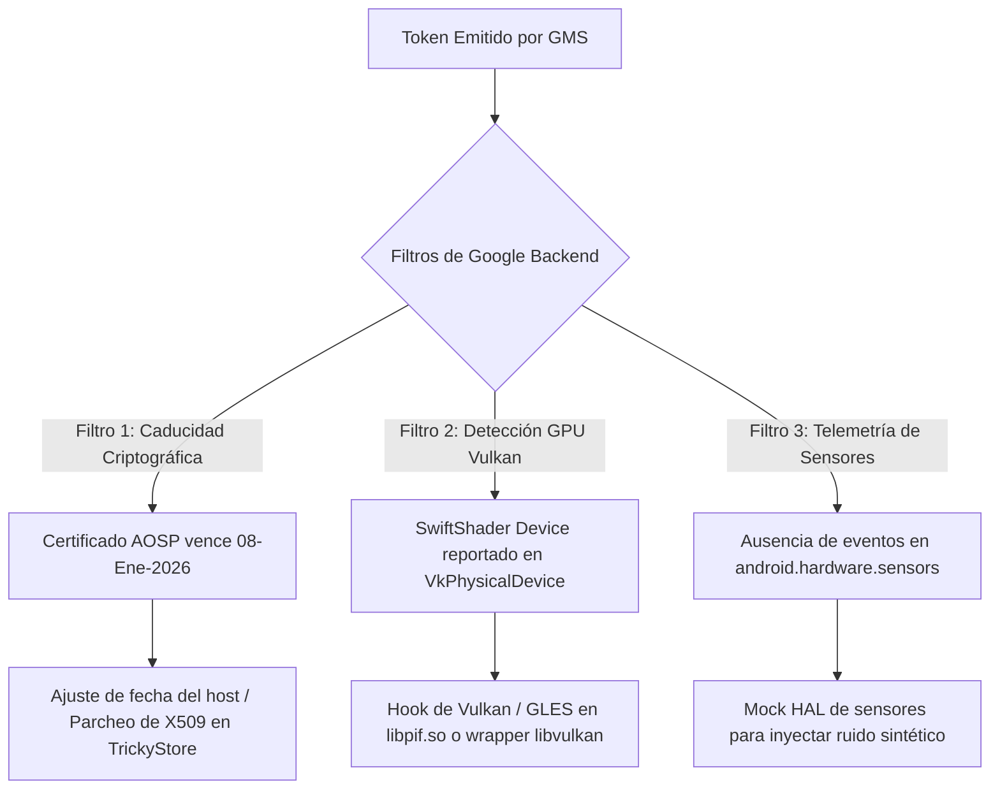

# Informe Técnico de Arquitectura, Depuración y Reproducción
## Laboratorio ReDroid + Play Integrity (Xiaomi Redmi 5 Plus / vince)
**Fecha de actualización:** 23 de Septiembre de 2026  
**Ambiente:** Host Linux x86_64 (CachyOS/Arch), Docker, ReDroid 14.0.0 (x86_64 64-only + GApps)

---

## 1. Resumen Ejecutivo del Estado del Sistema

El objetivo del laboratorio es ejecutar un contenedor Android 14 (`redroid`) capaz de superar las validaciones de **Google Play Integrity API** (`MEETS_BASIC_INTEGRITY` y `MEETS_DEVICE_INTEGRITY`), con streaming visual fluido vía `scrcpy`, emulando un dispositivo físico real sin depender de root gráfico ni herramientas con detección activa.

### Estado Actual de Componentes:
| Componente | Estado | Detalle |
|---|---|---|
| **Interfaz Gráfica (`scrcpy`)** | **100% Funcional** | Codec2 software + ANGLE EGL a 24-60 FPS sin pantalla negra. |
| **Atestación de Claves (Keystore2)** | **100% Funcional** | `TrickyStore OSS v3.1.0` inyectado en `keystore2` con daemon Java activo. |
| **Persistencia y Auto-arranque** | **100% Funcional** | TrickyStore y props se inician de forma nativa vía servicio de Android `init` (`trickystore.rc`). |
| **Enmascaramiento de Identidad** | **100% Funcional** | Xiaomi Redmi 5 Plus (`vince`), SoC MSM8953, 8 núcleos Cortex-A53, kernel Xiaomi 4.9. |
| **Generación de Tokens (GMS/Finsky)**| **100% Funcional** | Clave `integrity.api.key.alias` generada con éxito; Finsky emite tokens criptográficos. |
| **Evaluación DroidGuard (Google)** | **En progreso** | El backend responde `UNEVALUATED` debido a la telemetría del driver Vulkan (SwiftShader) y caducidad de certificados AOSP 2026. |

---

## 2. Mapa y Ubicación de Todos los Archivos del Proyecto

Ubicación principal en el host:
`/home/nahuel/Documentos/open-code-folder/redroid-integrity-lab/`

### Estructura de Directorios y Archivos Críticos:
```text
redroid-integrity-lab/
├── docker-compose.yml              # Definición del contenedor, puertos, volúmenes y comandos de arranque
├── Dockerfile                      # Capas del contenedor (GApps, Magisk base, resetprop)
├── apply-integrity-props.sh        # Script maestro ejecutado en boot_completed (enmascara /proc, props, oculta emulador)
├── start-trickystore.sh            # Script del daemon TrickyStore ejecutado como servicio nativo por init
├── media_codecs.xml                # Definición de codificadores software Codec2 (avc, opus) para scrcpy
├── pif.json                        # Configuración de suplantación de propiedades para Play Integrity Fix
├── libpif.so                       # Biblioteca nativa de PlayIntegrityFix
├── libprocessgroup.so              # Wrapper de inyección en Zygote (LD_PRELOAD / system override)
├── inject                          # Binario ELF x86_64 de inyección ptrace (inyecta .so en keystore2)
│
├── proc/                           # Archivos falsos montados sobre el procfs de Android
│   ├── cpuinfo                     # 8x Cortex-A53 real (implementer 0x41, part 0xd03, Qualcomm MSM8953)
│   ├── cmdline                     # Línea de comandos de arranque Qualcomm MSM8953
│   ├── version                     # Kernel Linux 4.9.337-perf+ (compilación Xiaomi vince)
│   └── boot_id                     # UUID falso estático
│
├── props/                          # Particiones de build.prop montadas en /system, /vendor, /product, /system_ext
│   ├── system_build.prop           # Propiedades de partición system (identidad vince, ro.debuggable=1 preservado)
│   ├── vendor_build.prop           # Propiedades de partición vendor
│   ├── product_build.prop          # Propiedades de partición product
│   └── system_ext_build.prop       # Propiedades de partición system_ext
│
├── build_magisk/
│   └── system/
│       ├── bin/apply-props.sh      # Respaldo del script de propiedades
│       └── etc/init/
│           ├── bootanim.rc         # Disparadores tempranos de Magisk bootless
│           └── integrity_props.rc  # Declaración del servicio nativo 'trickystore' y hook boot_completed
│
└── data/                           # Volumen persistente de la partición /data de Android
    ├── misc/adb/adb_keys           # Clave pública de ADB del host para conexión sin prompts
    ├── system/locksettings.db      # Base de datos de seguridad de usuario (limpia de credenciales rotas)
    └── adb/
        ├── tricky_store/
        │   ├── keybox.xml          # Claves ECDSA y cadena de certificados de atestación hardware
        │   ├── target.txt          # Paquetes objetivo forzados con sufijo '!' (GMS, Vending, Checkers)
        │   └── security_patch.txt  # Parche de seguridad para TrickyStore (20180401)
        └── modules/tricky_store/
            ├── inject              # Ejecutable de inyección a keystore2
            ├── libTrickyStoreOSS.so# Biblioteca interceptora de llamadas Binder de keystore2
            ├── classes.dex         # Clases DEX del daemon criptográfico TrickyStoreOSS
            └── daemon              # Wrapper ejecutor vía app_process
```

---

## 3. Problemas Críticos Diagnosticados y Solucionados

Durante la evolución del laboratorio se produjeron varios fallos bloqueantes. A continuación se documenta su causa raíz y solución:

### A. Fallo de Pantalla Negra en `scrcpy` (Crash Loop en `SystemUI`)
* **Síntoma:** `scrcpy` conectaba correctamente pero mostraba una ventana completamente negra. Las capturas de pantalla medían apenas 6 KB (cuadros vacíos).
* **Causa Raíz:** Se había configurado `ro.hardware.egl=mesa`. ReDroid en modo `guest` renderiza a través de **ANGLE** sobre Vulkan SwiftShader (`libEGL_angle.so` de 8.3 MB), mientras que `libEGL_mesa.so` es un stub de 63 KB. Al forzar `mesa`, el motor de renderizado fallaba al generar EGL images para los drawables del sistema, provocando un `NullPointerException` en `KeyButtonDrawable.draw()` dentro de `com.android.systemui`. Sin SystemUI, SurfaceFlinger no componía ventanas de aplicaciones.
* **Solución:** Se fijó de forma obligatoria `ro.hardware.egl=angle` en `apply-integrity-props.sh`. SystemUI y Launcher3 levantaron de inmediato, restaurando la interfaz gráfica completa (capturas de ~670 KB).

### B. Muerte de Init al pasar `androidboot.hardware=qcom`
* **Síntoma:** Al arrancar el contenedor con `androidboot.hardware=qcom` en los argumentos del kernel de Docker, el sistema se reiniciaba indefinidamente y ADB quedaba en estado `offline`.
* **Causa Raíz:** Android `init` utiliza el valor de `androidboot.hardware` para localizar su script de arranque principal (`init.<hardware>.rc`). Al recibir `qcom`, buscaba `init.qcom.rc` (inexistente en la imagen ReDroid), omitiendo `init.redroid.rc` y quebrando todos los servicios esenciales.
* **Solución:** Se mantuvo el arranque con `androidboot.hardware=redroid` a nivel de kernel, y la suplantación de `ro.hardware=qcom` y `ro.boot.hardware=qcom` se realiza en espacio de usuario mediante `resetprop` en `boot_completed`.

### C. Crash Loop por `locksettings.db` (SyntheticPassword)
* **Síntoma:** `system_server` moría cada 5 segundos con el error:  
  `java.lang.IllegalStateException: SP protector key is missing: synthetic_password_53d0d0415b9ba1f`.
* **Causa Raíz:** Al reiniciar o alterar el almacén de claves, la base de datos de credenciales de pantalla de bloqueo conservaba un handle sintético (`sp-handle`) que ya no existía en el Keystore.
* **Solución:** Se purgó la tabla `locksettings` de `/data/system/locksettings.db`, eliminando los registros huérfanos con:
  ```python
  DELETE FROM locksettings WHERE name LIKE '%sp%';
  ```

### D. Crash Loop del HAL de Bluetooth Simulado
* **Síntoma:** Múltiples `tombstones` generados por `/vendor/bin/hw/android.hardware.bluetooth@1.1-service.sim` con abortos:  
  `Check failed: Address::FromString("3C:5A:B4:04:05:06", public_address)`.
* **Causa Raíz:** El daemon emulador de Bluetooth de ReDroid falla en el parsing de direcciones MAC bajo ciertas configuraciones regionales.
* **Solución:** Se deshabilitó de forma persistente en `apply-integrity-props.sh`:
  ```sh
  pm disable com.android.bluetooth
  settings put global bluetooth_on 0
  ```

### E. Automatización Nativa de TrickyStore (Persistencia ante Reinicios)
* **Síntoma:** Tras ejecutar `docker stop` y `docker-compose up -d`, Play Integrity daba veredicto rojo inmediato porque TrickyStore requería ser ejecutado manualmente vía `docker exec`.
* **Causa Raíz:** En Android `init`, los scripts ejecutados mediante directivas `exec` matan a todos sus procesos hijos al finalizar su ejecución (por pertenecer al mismo cgroup). Los subshells en segundo plano (`( ... ) &`) morían al instante.
* **Solución:** Se integró TrickyStore como servicio nativo de Android en `integrity_props.rc`:
  ```rc
  service trickystore /system/bin/start-trickystore.sh
      user root
      group root
      seclabel u:r:su:s0
      disabled

  on property:sys.boot_completed=1
      exec u:r:su:s0 root root -- /system/bin/apply-props.sh
      start trickystore
  ```
  `apply-props.sh` ejecuta la inyección en `keystore2` y acto seguido `init` arranca y supervisa el daemon Java `TrickyStoreOSS`.

---

## 4. Guía de Reproducción Paso a Paso desde Cero

Para desplegar este entorno idéntico en cualquier máquina host con Linux:

### Paso 1: Prerrequisitos en el Host
1. Instalar paquetes necesarios:
   ```bash
   sudo pacman -S docker docker-compose android-tools scrcpy
   ```
2. Cargar módulos del kernel de Android:
   ```bash
   sudo modprobe binder_linux devices="binder,hwbinder,vndbinder"
   sudo modprobe ashmem_linux 2>/dev/null || true
   ```
3. Autorizar la clave ADB del host de forma transparente:
   Asegurarse de que `~/.android/adbkey.pub` exista.

### Paso 2: Descarga de Componentes de TrickyStore
Si los archivos dentro de `data/` no estuvieran presentes:
```bash
wget https://github.com/beakthoven/TrickyStoreOSS/releases/download/v3.1.0/Tricky-Store-OSS-v3.1.0-172-41383f5-Release.zip -O /tmp/TrickyStore.zip
# Extraer binarios x86_64
unzip -p /tmp/TrickyStore.zip classes.dex > data/adb/modules/tricky_store/classes.dex
unzip -p /tmp/TrickyStore.zip lib/x86_64/libTrickyStoreOSS.so > data/adb/modules/tricky_store/libTrickyStoreOSS.so
unzip -p /tmp/TrickyStore.zip lib/x86_64/libinject.so > data/adb/modules/tricky_store/inject
unzip -p /tmp/TrickyStore.zip keybox.xml > data/adb/tricky_store/keybox.xml
unzip -p /tmp/TrickyStore.zip target.txt > data/adb/tricky_store/target.txt
```

### Paso 3: Configurar Archivos Clave
Asegurar que los permisos de los scripts sean ejecutables:
```bash
chmod +x apply-integrity-props.sh start-trickystore.sh
```

Asegurar que `data/adb/tricky_store/target.txt` contenga las apps de evaluación con forzado `!`:
```text
com.android.vending!
com.google.android.gms!
io.github.vvb2060.keyattestation!
gr.nikolasspyr.integritycheck!
```

### Paso 4: Construir la Imagen e Iniciar
1. Reconstruir imagen Docker (incorpora GApps y binarios base):
   ```bash
   docker build -t redroid:14.0.0-gapps .
   ```
2. Iniciar el laboratorio:
   ```bash
   docker compose up -d
   ```
3. Esperar 10 segundos al arranque y conectar:
   ```bash
   adb connect localhost:5580
   scrcpy -s localhost:5580
   ```

### Paso 5: Verificación Automática en una Línea
Para comprobar que el entorno levantó 100% operativo:
```bash
adb -s localhost:5580 shell "getprop ro.product.model; getprop init.svc.trickystore; cat /proc/cpuinfo | grep Hardware"
```
Salida esperada:
```text
Redmi 5 Plus
running
Hardware	: Qualcomm Technologies, Inc MSM8953
```

---

## 5. Vectores Restantes para Superar `UNEVALUATED` en DroidGuard

Para pasar de la emisión del token a los veredictos verdes (`MEETS_BASIC_INTEGRITY` / `MEETS_DEVICE_INTEGRITY`), quedan dos factores que la telemetría de Google analiza:



1. **Vector de Fecha / Certificados:**
   El keybox de software estándar de AOSP posee un certificado raíz/intermedio con validez hasta el **8 de enero de 2026**. Dado que la fecha del sistema está situada en septiembre de 2026, Google rechaza la atestación por certificado caducado antes de evaluar el hardware.
2. **Vector de GPU SwiftShader:**
   En los registros de DroidGuard (`com.google.android.gms.unstable`), se observan consultas a `VkPhysicalDevice` donde ANGLE expone `SwiftShader Device (LLVM 10.0.0)`. Es necesario interceptar las llamadas de enumeración de dispositivos Vulkan para reportar `Adreno (TM) 506`.
3. **Vector de Sensores:**
   Implementar un mock ligero que simule actividad de acelerómetro para evitar la firma de entorno headless/estático.
